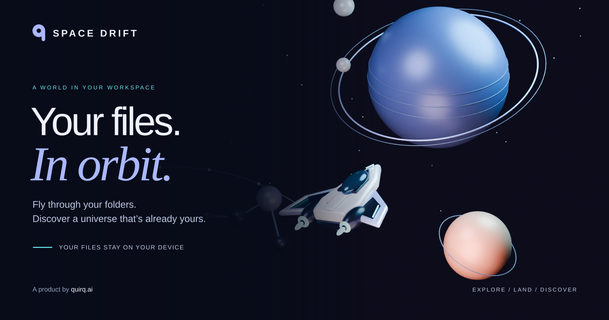

# Space Drift



Fly a small ship through a living map of a local folder. Folders form districts, file size gives objects mass, and file activity creates currents you can feel while flying. The hosted game runs entirely in your browser: choose a folder, fly through its metadata, and press E to read a file locally. An optional Node.js server retains desktop-app integration for local use.

## Use a local folder in the browser

Open the hosted HTTPS app and choose a folder through the folder button. The browser grants Space Drift read access to that selection; files are not uploaded. WebGL is required for the game.

- **Chrome and Edge:** the directory-handle picker allows the game to scan the chosen folder again every five seconds while the page is open. Edits and newly added or removed files become activity in the world. The picker requires a secure context (HTTPS, or a trusted loopback development address) and a direct click. See the [directory picker API](https://developer.mozilla.org/en-US/docs/Web/API/Window/showDirectoryPicker).
- **Other browsers:** the directory-input fallback provides a snapshot of the selected files through `webkitdirectory`. Choose the folder again to refresh it after changes. The browser may label the selection as an upload, but Space Drift processes that selection locally. Relative paths come from the [browser's File API](https://developer.mozilla.org/en-US/docs/Web/API/File/webkitRelativePath).

Folder access lasts for this page session. Browsers can deny access to protected folders; choose another folder if the picker refuses it. The hosted app has no local Git-process access, native-app launching, or Finder integration. It shows the files exposed by your chosen folder, rather than reading Git history or watching disk traffic.

## Build and preview

Requires Node.js 20 or newer and npm for development and builds. The deployed app does not need a Node server.

```sh
cd space-drift
npm ci
npm run build
npm run preview
```

Open [the static preview](http://127.0.0.1:4190) and choose a folder in the browser. `npm run build` produces `dist/` from the public app plus the two Three.js runtime modules and their license. The preview serves only this output directory on loopback, with no file-scanning API. Stop it with Ctrl+C.

## Deploy to Vercel

Import this repository into Vercel with its repository root as the Root Directory. The included `vercel.json` selects the **Other** framework preset (`framework: null`), runs `npm run build`, and publishes `dist/`. These are the documented [Vercel build configuration fields](https://vercel.com/docs/project-configuration/vercel-json). No runtime functions or API rewrites are needed, and no environment variables are required by the app.

For CLI deployment, link the repository to the intended Vercel account/project, then deploy a preview:

```sh
vercel link
vercel deploy
```

Check the preview's folder selection, flight, and E file opening before promoting or deploying production. `.vercelignore` excludes local project metadata, dependencies, generated output, environment files, and the optional Node backend from deployment uploads. The build publishes only browser assets; selected folders never enter the build or deployment.

## Optional local server

The original Node mode remains available for automatic scanning and desktop-app opening:

```sh
npm start
```

Open [local server mode](http://127.0.0.1:4188). Its default map is the parent folder containing this repository (the `quirq` project in the original workspace). To select another folder or port:

```sh
npm start -- --root "/absolute/path/to/your/folder" --port 4188
```

The server stays on loopback. Stop it with Ctrl+C. Unlike the hosted app, it can use the local filesystem scanner and the supported macOS desktop opener.

## Fly

- W / up arrow: thrust forward.
- S / down arrow: reverse thrust.
- A / D or left / right arrows: steer.
- R / F: rise / descend.
- Shift: boost.
- Space: brake.
- E: open the selected file within 18 units. Opening a new file also charts it; visited files can be reopened.
- Move the mouse, or drag the scene on touch: move the aiming reticle independently of the ship. A cyan reticle locks onto the closest file in its narrow aim cone.
- Left click or Q: fire a probe at the locked file. Probes reach files within 160 units, then open and chart them exactly like a proximity open. C: center the reticle on the ship's forward vector.
- M: open the atlas; search for a file or choose a folder to fly there automatically. Any steering input returns manual control.
- Escape: pause or resume flight. H: open the flight manual.
- Home: return to the launch point.

Click **Launch expedition** to begin. Chart five files to complete the first expedition, then keep exploring. Exploration progress lasts for the current browser session. Touch controls provide forward thrust, left/right steering, proximity opening, probe firing, and reticle centering; drag open space to aim. The atlas handles longer trips.

The interface includes exploration and navigation controls. A live directory handle or the optional local server refreshes the world every five seconds while the page is open; a directory-input snapshot requires choosing the folder again. Edit, add, rename, or move a file in your normal editor or file manager to create activity. The game itself does not change your files.

## Tech stack

| Layer | Technology | Role |
| --- | --- | --- |
| Hosted app | Static HTML, CSS, and JavaScript ES modules | Runs the game without a backend. |
| 3D rendering | [Three.js](https://threejs.org/) | Draws the space map and ship. |
| Browser files | Directory handles or `webkitdirectory` file snapshots | Reads selected-folder metadata and on-demand local previews. |
| Build / preview | Node.js 20+ and native filesystem/HTTP APIs | Copies public assets and serves a local static preview. |
| Optional local server | Native `node:http`, filesystem APIs and streams | Supplies bounded filesystem scans, file previews, and desktop integration. |
| Tests | Node.js built-in test runner | Covers scanning, file access, physics, and HTTP boundaries. |

## Architecture

```text
Vercel / static host                     YOUR COMPUTER
┌─────────────────────┐           ┌────────────────────────────────────┐
│ HTML + CSS + JS     │ ────────>  │ Browser: ship, world, atlas, viewer │
│ Three.js modules   │           │                ↕                   │
└─────────────────────┘           │ Chosen local folder / file snapshot│
                                 └────────────────────────────────────┘
                                  Metadata and contents stay here.

Optional local mode on the same computer:
Browser ↔ 127.0.0.1 Node server ↔ eligible local files / macOS opener
```

The hosted app reads a user-selected folder through browser file APIs. Map metadata and file previews remain in the browser; there is no hosted `/api/world` or file-content service. In optional local-server mode, `/api/world` provides snapshots and the local file endpoints provide previews, with paths confined to the eligible map. The built `runtime.json` sets `localServer: false`, so hosted pages skip local API requests; the optional Node server overrides that route with `localServer: true`.

## Flight and exploration flow

```text
Open Space Drift
    |
    v
Choose folder / load local snapshot ----> districts, file crystals, activity currents
    |
    v
Launch expedition
    |
    +--> Manual flight: W/A/S/D, R/F, Shift, Space
    |          |
    |          +--> press E nearby, or aim and fire from up to 90 units away
    |          |          |
    |          |          +--> open local preview --> close / Escape --> resume at the same location
    |          |          |
    |          |          +--> first visit charts the file --> 5 charted files complete the expedition
    |          |
    |          +--> press M --> search atlas or choose a district/file --> guided flight
    |                                                              |
    +--------------------------------------------------------------+--> any steering input returns to manual flight
```

## Open a file

The pure model tests additionally cover deterministic layout, frame-rate-independent movement, boosted collision, crystal-tip collision, bounded mass attraction, and empty maps. `npm run check` checks server and browser JavaScript syntax. A read-only `window.__SPACE_DRIFT__.getState()` diagnostic reports position, velocity, current destination, exploration progress, render counters, and live-event counts; the same snapshot is available on `#scene` as `data-telemetry`.

Initial flight prototype verified locally on 2026-09-07: all 14 original tests and syntax checks passed; browser playtesting covered launch, keyboard thrust/steering/altitude, atlas search, continuous flight to `PROJECT.md`, targeted E scanning, live creation/modification events, 1280×800 and 390×844 layouts, and a clean browser error log.

The Space Drift update passes 22 tests covering file access, safe text previews, media ranges, and desktop launch arguments with an injected executor. Browser checks verified text and PDF opening with E, reopening a visited file without duplicate progress, paused flight during reading, held arrival, and desktop/mobile viewer layouts.

The hosted-folder update was verified on 2026-09-08: all 37 tests, syntax checks, and the static build pass. Browser checks against the static preview covered selecting a real folder snapshot, atlas-guided flight, E text opening and reopening, switching folders, disconnecting, hidden-file exclusions, and desktop/mobile layouts with no browser errors. The optional Node server still connects automatically. Live directory refresh, permission failures, cancellation, and scan limits are covered by automated handle tests; the native Chrome/Edge directory picker still needs an interactive check on the deployed site.

## Code map

- `vercel.json`: static hosting build and output settings.
- `scripts/build.mjs`: browser-asset build with the required Three.js modules.
- `scripts/preview.mjs`: confined static preview on loopback port 4190.
- `scripts/check.mjs`: syntax checks for app, server, scripts, and test modules.
- `server.mjs`: optional local HTTP server and access boundaries.
- `lib/scan.mjs`: bounded folder scan and metadata differences.
- `lib/files.mjs`: confined file access, bounded previews, and desktop opening.
- `public/folder-source.js`: bounded browser-directory scans, file snapshots, and live metadata differences.
- `public/model.js`: repeatable world generation and flight physics.
- `public/main.js`: Three.js scene, controls, guided flight and exploration.
- `public/viewer.js` / `viewer.css`: local file viewer and return-to-flight behavior.
- `public/index.html` / `styles.css`: Space Drift branding and responsive controls.

Inspired by [Building games with Astra](https://developers.openai.com/blog/how-to-build-games-with-astra): begin with a playable experience, separate simulation from rendering, and expose enough state to verify actual journeys.
